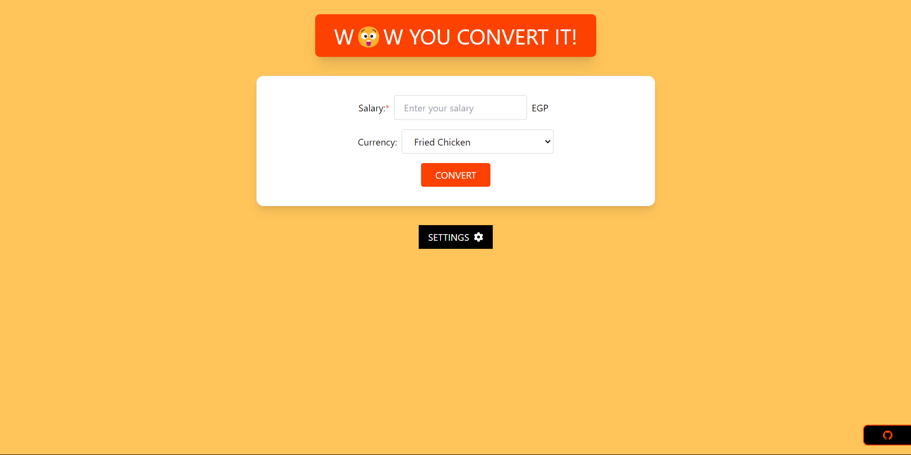

# Wow You Convert It

## Description
W😲W You Convert It is a simple tool that allows you to see what your salary is worth in various wow currencies. If you want to add a fun twist to understanding your salary, this tool is for you.

## How it works
Wow You Convert It takes your real-life salary as input and converts it into different W😲W currencies based on current exchange rates. You simply input your salary amount, select the currency you're paid in, and choose the W😲W  currency you want to convert it to. The tool then calculates the equivalent amount in W😲W currencies.

## Demo
You can try out Wow You Convert It by visiting the [live demo](https://wowyouconvertit.netlify.app/).

## Screenshots

## Features
- Convert your salary into WoW gold, silver, or copper.
- Choose from a variety of WoW currencies.
- Simple and intuitive interface.

## Technologies
- React
- Tailwind CSS
- Framer Motion

## Usage
1. Input your salary amount.
2. Choose the WoW currency you want to convert to.
3. Click the "Convert" button to see the equivalent amount.

## Installation
This tool is a web application and can be accessed through any modern web browser. No installation is required.

## Development
If you want to contribute to the development of Wow You Convert It, feel free to fork this repository and submit pull requests. 

## Credits
Wow You Convert It was created by Abdulrahman Moussa.

## License
This project is licensed under the [MIT License](LICENSE).
